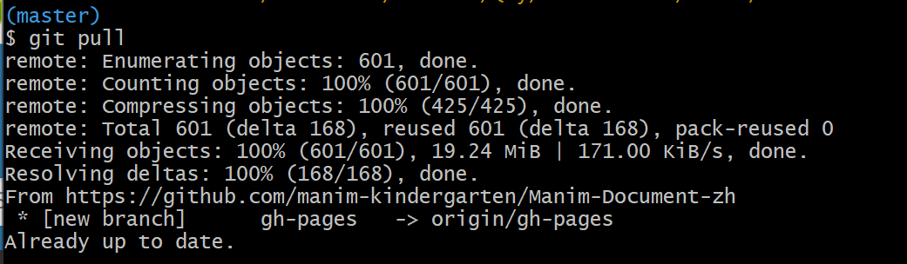

# Manim-Document-zh
整理得一份Manim中文文档，我希望它能成为比较全面能帮助到你使用Manim的文档，共建Manim美好社区。

不想写Sphinx生成html文件可以直接下载Release，python安装Sphinx之后就能 `make html` ,生成网页，能在本地修改整理自己的manim笔记系统，用以备忘查询。```make pdf```则是生成pdf，配置文件是conf.py，可以修改主题。markdown/latex可以用pandoc转rst，*.py文件可以用jupyter转rst。

第七章用到sphinx自动文档插件，需要在python搜索路径添加manim保存位置变量，方法有很多：

1. ```sys.path.append("c:\\你的本地磁盘manim位置")```

2. 或者manim的本地位置添加到PYTHONPATH环境变量。


```python
import sys
sys.path #查看路径是否添加成功
import manim #不报错说明添加成功
```

html文档支持中文搜索，需要安装sphinx插件要安装```pip install jieba```

不习惯ReStructuredText语法的可以Pandoc把Makrdown等文件转换rst，或者JupyterNoteBook把py等文件转换rst。

其实建议使用Pandoc：

`pandoc readme.md --from markdown --to rst -s -o readme.rst`

或者

`pip install pypandoc`

然后

```
import pypandoc
output = pypandoc.convert('somefile.md', 'rst')
```

- 别```make clean```会删除build文件夹从而清除build/html/.git的gh-pages

尚有疑问：build\html\.git保存gh-pages分支，但是如果每次我使用make clean会删除build目录下所有文件，make再生成build目录下的html网页文档。
那我现在岂不是不能用make clean?

解决办法是在另一个文件夹，make clean ,make html,然后把更新后的sources文件夹和build文件夹复制过来这里替换。

主目录下master保存的.git隐藏文件夹在我git pull后



这说明他有保存gh-pages分支的信息，那我build\html\.git隐藏文件夹还能不能删除(make clean就会清楚build文件夹下的所有文件)？


现阶段解决办法是：因为build/html/.git保存分支的信息，用来生成在线浏览的网页。如果你想提交PR的话，请复制一份在那里修改，因为make clean 会清楚build目录下全部文件，所以需要你把修改后的build文件夹和soures文件夹复制粘贴然后git push。