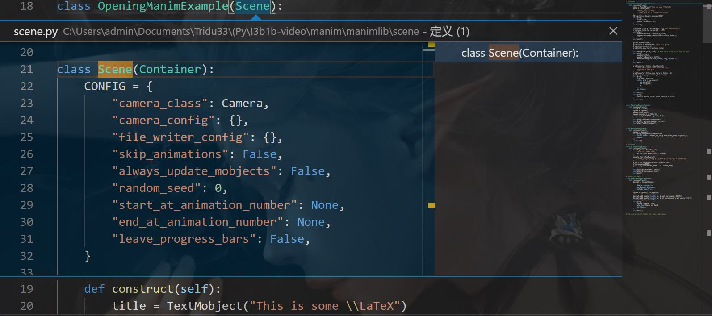
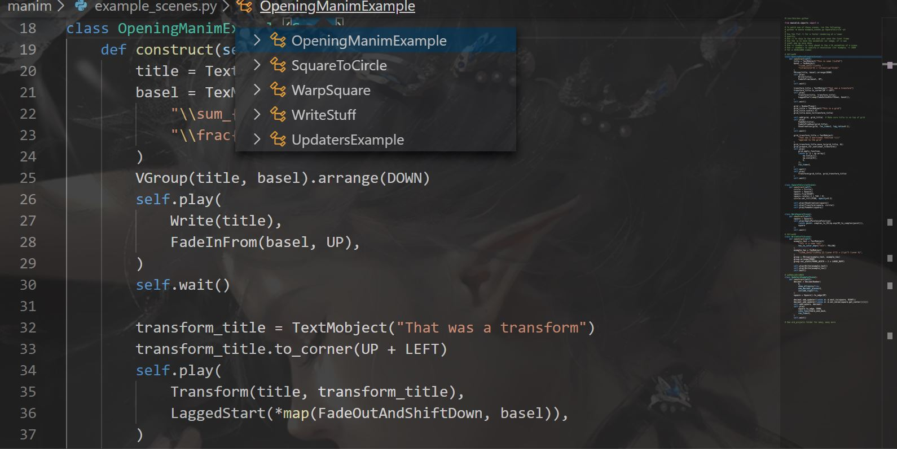

Learning by Example案例学习
=============================

写视频之前必须学会制作图片，因为视频就是根据帧率连续播放图片的过程。

.. admonition:: 声明

      此例子，来自 `这一集 <https://www.bilibili.com/video/BV1W4411Z7Zt?p=5>`_    。

example_scenes.py中自定义一个类。

.. code::

   class FirstScene(Scene): 
      def construct(self): 
         text=TextMobject("text")
         self.add(text)

命令行

.. code::

    python -m manim  example_scenes.py FirstScene -ps

新版本中，任何py文件只要不选定里面的类（比如FirstScene）

.. code::

   python -m manim  example_scenes.py -ps

就会让你选：

.. code::

   1: FirstScene
   2: OpeningManimExample
   3: SquareToCircle
   4: UpdatersExample
   5: WarpSquare
   6: WriteStuff

   Choose number corresponding to desired scene/arguments.
   (Use comma separated list for multiple entries)
   Choice(s):     

.. figure:: ../assets/image/FirstScene.png
    :width: 100%
    :align: center

    FirstScene

画点

.. code::

   Class Positions(Scene):
      def construct(self):
         object=Dot()
         #用object.to_edge(UP)传参为常量中的向量UP可以向量指定位置np.array((0., 1., 0.))
         #用object.to_corner(UR)传参为常量中的向量UR可以移动到向量指定位置np.array((右1., 上1., 0.))
         self.add(object)
         self.wait()

定位方式可以有绝对和相对定位。

绝对定位

.to_edge()和.to_corner()方法

.to_edge(DIRECTION,buff=NUMBER)，可以设置边距buff

相对定位

.move_to()

.next_to()

.shift()

SquareToCircle成方圆
-----------------------

.. admonition:: 声明

   这部分是EulerTour写的教程,我只是翻译+学习笔记，github早就有很多教程，但是为了方便查询使用，我才整合这么一份文档。他还整了个在线manim网站 `www.eulertour.com <https://www.eulertour.com/>`_

样例 ``example_scenes.py`` contains simple examples that we can use to learn about manim.

Go ahead and try out the ``SquareToCircle`` scene by running it with 命令 ``$ manim example_scenes.py SquareToCircle -p``
in manim directory.

.. code-block:: python
   :linenos:

   from manimlib.imports import *

   class SquareToCircle(Scene):
       def construct(self):
           circle = Circle()
           square = Square()
           square.flip(RIGHT)
           square.rotate(-3 * TAU / 8)
           circle.set_fill(PINK, opacity=0.5)

           self.play(ShowCreation(square))
           self.play(Transform(square, circle))
           self.play(FadeOut(square))
   

.. raw:: html

   <video width="560" height="315" controls>
       <source src="../_static/Animation/SquareToCircle.mp4" type="video/mp4">
   </video>

.. note::

  The flag ``-p`` plays the rendered video with default video player.预览

  Other frequently used flags are:

    * ``-l`` for rendering video in lower resolution低分辨率 (which renders faster)渲染更快
    * ``-s`` to show the last frame of the video.显示最后一帧

  Run ``manim -h`` all the available flags (``python -m manim -h`` if you installed it to a venv)

Let's step through each line of ``SquareToCircle``，一行行看

.. code-block:: python
   :lineno-start: 3

   class SquareToCircle(Scene):

You create videos in manim by writing :class:`~scene.scene.Scene` classes.

    VisualStudioCode ctrl+点击查看类定义

Each :class:`~scene.scene.Scene` in manim is self-contained配套齐全的/自给自足的. That means everything
you created under this scene does not exist outside the class.意思是：

    如图几个Scene类互不影响

比如 ``$ manim example_scenes.py OpeningManimExample -pl`` 和 SquareToCircle 的代码,不相干。

.. code-block:: python
   :lineno-start: 4

   def construct(self):

:meth:`~scene.scene.Scene.construct` specifies what is displayed on the screen
when the :class:`~scene.scene.Scene` is rendered to video.Scene类渲染时指定屏幕中要罗列的什么。

.. code-block:: python
   :lineno-start: 5

   circle = Circle()
   square = Square()

``Circle()`` and ``Square()`` create :class:`~mobject.geometry.Circle` and :class:`~mobject.geometry.Square`.

Both of these are instances of :class:`~mobject.mobject.Mobject` subclasses子类Moject实例, the base class for objects对象的基类 in manim. Note
that instantiating a :class:`~mobject.mobject.Mobject` does not add it to the
:class:`~scene.scene.Scene`, so you wouldn't see anything if you were to render
the :class:`~scene.scene.Scene` at this point.实例化方圆对象，还没添加到Scene类中，没渲染对应的Scene之前不能看见。

.. code-block:: python
   :lineno-start: 7

   square.flip(RIGHT)
   square.rotate(-3 * TAU / 8)
   circle.set_fill(PINK, opacity=0.5)

``flip()`` ``rotate()`` ``set_fill()`` （方法依然可以在VisualStudioCode用ctrl+点击查看定义） apply various modifications应用各种mobjects的变更 to the mobjects before animating
them.  The call to :meth:`~mobject.mobject.Mobject.flip` flips the
:class:`~mobject.geometry.Square` across the RIGHT vector.  This is equivalent
to a refection across the x-axis.默认方形是从左上角点顺时针，关于x轴对称翻折=关于RIGHT（定义在manimlib/constants.py）常量向量np.array((1., 0., 0.))对称镜像，结果是从左下角点逆时针。

The call to :meth:`~mobject.mobject.Mobject.rotate` rotates the
:class:`~mobject.geometry.Square` 3/8ths of a full rotation counterclockwise逆时针旋转3/8圆.

The call to :meth:`~mobject.mobject.Mobject.set_fill` sets
the fill color for the :class:`~mobject.geometry.Circle` to pink粉色填充, and its opacity不透明度 to 0.5.

.. code-block:: python
   :lineno-start: 11

   self.play(ShowCreation(square))
   self.play(Transform(square, circle))
   self.play(FadeOut(square))

To generated animation, :class:`~animation.animation.Animation` classes动画类 are used.

每个动画类传入1或多个Mobject对象参数Each :class:`~animation.animation.Animation` takes one or more :class:`~mobject.mobject.Mobject` instances as arguments, which it animates
when passed to :meth:`~scene.scene.Scene.play` 应用play()方法. This is how video is typically
created in manim.

:class:`~mobject.mobject.Mobject` instances are automatically added to the :class:`~scene.scene.Scene` when they are animated 动画化Mobject对象时自动添加到场景. 
You can add a :class:`~mobject.mobject.Mobject` to the :class:`~scene.scene.Scene` manually by passing it as an argument to  :meth:`~scene.scene.Scene.add` 用此方法手动添加mobject到scene场景.

:class:`~animation.creation.ShowCreation` draws a :class:`~mobject.mobject.Mobject` to the screen显示在屏幕上.

:class:`~animation.transform.Transform` morphs one :class:`~mobject.mobject.Mobject` into another变换为另一个图形.

:class:`~animation.creation.FadeOut` fades a :class:`~mobject.mobject.Mobject` out of the :class:`~scene.scene.Scene`.淡出

.. note::

  第一个Mobject对象会被 :class:`~animation.transform.Transform`  方法修改，第二个对象不会被添加到Scene类中。
  Only the first argument to :class:`~animation.transform.Transform` is modified,
  the second is not added to the :class:`~scene.scene.Scene`. :class:`~animation.tranform.Transform`
  only changes the appearance外形 but not the underlying根本/基础的 properties属性.

  After the call to   ``transform()`` , ``square`` is still a   :class:`~mobject.geometry.Square`  instance but with the shape of :class:`~mobject.geometry.Circle` .
  例子中， ``transform()``  变换后  ``square``  还是  :class:`~mobject.geometry.Square` 的实例，仅仅是渲染出来圆形外表，还要调用 :class:`~mobject.geometry.Square` 的属性和方法。`03:40动画很清晰 <https://www.bilibili.com/video/BV1W4411Z7Zt?p=11>`_ 。
   

补充一个类似的案例：from `manim-tutorial <https://github.com/malhotra5/Manim-Tutorial>`_ 。

.. literalinclude:: ../assets/code/manim-tutorial/basics.py
   :linenos:

.. raw:: html

    <video width="700" height="394" controls>
        <source src="../_static/manim-tutorial/basics_Shapes.mp4" type="video/mp4">
    </video>

manim help帮助 
-----------------------

``python -m  manim --help``

.. parsed-literal::

   usage: manim.py [-h] [-p] [-w] [-s] [-l] [-m] [--high_quality] [-g] [-i] [-f]
                  [-t] [-q] [-a] [-o FILE_NAME] [-n START_AT_ANIMATION_NUMBER从动画编号开始]
                  [-r 分辨率RESOLUTION] [-c COLOR] [--sound] [--leave_progress_bars]
                  [--media_dir MEDIA_DIR]
                  [--video_dir VIDEO_DIR | --video_output_dir VIDEO_OUTPUT_DIR]
                  [--tex_dir TEX_DIR] [--livestream] [--to-twitch]
                  [--with-key TWITCH_KEY]
                  [file] [scene_names [scene_names ...]]
   positional arguments:
   file                  path to file holding the python code for the scene包含场景的python代码的文件的路径，如example_scenes.py 
   scene_names           Name of the Scene class you want to see您要查看的Scene类的名称，如SquareToCircle

   optional arguments:
   -h, --help            show this help message and exit
   -p, --preview         Automatically open the saved file once its done完成后自动打开预览保存的文件

   -w, --write_to_movie  Render the scene as a movie file将场景渲染为电影文件
   -s, --save_last_frame 显示最后一帧Save the last frame
   -l, --low_quality     Render at a low quality (for faster rendering)快，低质量渲染
   -m, --medium_quality  Render at a medium quality 中质量
   --high_quality        Render at a high quality 高质量
   -g, --save_pngs       Save each frame as a png 每帧保存png
   -i, --save_as_gif     Save the video as gif 视频保存为gif
   -f, --show_file_in_finder    Show the output file in finder 在finder中显示输出文件
   -t, --transparent     Render to a movie file with an alpha channel使用Alpha通道渲染到电影文件
   -q, --quiet
   -a, --write_all       Write all the scenes from a file写一个文件中所有场景
   -o FILE_NAME, --file_name FILE_NAME
                         Specify the name of the output file, ifit should be different from the scene class name指定输出文件的名称（如果它与场景类名称不同）
   -n START_AT_ANIMATION_NUMBER, --start_at_animation_number START_AT_ANIMATION_NUMBER
                         Start rendering not from the first animation, but from another, specified by its index. 
                         If you passin two comma separated values, e.g. "3,6", it will end the rendering at the second value。
                         不从第一个动画开始渲染，而是从其索引指定的另一个动画开始渲染。如果您传入两个逗号分隔的index值，
                         例如“ 3,6”，它将在第二个index值处结束渲染。
   -r RESOLUTION, --resolution RESOLUTION
                         Resolution, passed as "height,width"分辨率，“高度，宽度”传递
   -c COLOR, --color COLOR
                         Background color背景色
   --sound               Play a success/failure sound显示成功/失败的声音
   --leave_progress_bars
                         Leave progress bars displayed in terminal保持进度条显示在终端中，
   --media_dir MEDIA_DIR
                         directory to write media写入多媒体路径
   --video_dir VIDEO_DIR
                         directory to write file tree for video写入视频文件树的目录
   --video_output_dir VIDEO_OUTPUT_DIR
                         directory to write video 编写视频的目录
   --tex_dir TEX_DIR     directory to write tex 设置text路径
   --livestream          Run in streaming mode流模式
   --to-twitch           Stream to twitch
   --with-key TWITCH_KEY
                         Stream key for twitch

举几个例子，有些选项被禁用了，但是可以曲线救国，比如MP4用ffmpeg可以分出每帧的图片做成gif,格式转换在线工具也不少。

.. code-block:: bash

   manim example_scenes.py SquareToCircle -pl

默认 ``-preview`` 分辨率2560x1440 @ 60fps，在manimlib/contants.py有需要可以自行修改， ``-l`` 低分辨率480p15,小项目查阅的时候，快很多。

.. code-block::

  manim example_scenes.py SquareToCircle -ps

``-s`` 可以在images文件夹下看到保存的最后一张图片，比如在一个比较大的项目中，想看自己的某一张图画出来效果，可以最后一帧 ``self.play(ShowCreation(***))`` 然后 ``-s`` 看图。

.. code-block:: bash

   manim example_scenes.py SquareToCircle --write_all -l

``-a`` 把文件中所有scene写成视频。

.. code-block:: bash

  manim example_scenes.py SquareToCircle -o 指定文件名 

输出 指定文件名.mp4。

.. code-block:: bash

  manim example_scenes.py SquareToCircle -pl -c WHITE

在manimlib/constants.py中查看颜色映射，等于16进制#FFFFFF,也就是说可以直接在线取色器工具获得数值，传入想要的背景颜色。

.. code-block:: bash

  manim example_scenes.py SquareToCircle -pl -c '#FFFFFF' 

.. code-block:: bash

  manim example_scenes.py SquareToCircle -pl -c '#FFFFFF' 

.. code-block:: bash
   
   self.play(ShowCreation(square))#0
   self.play(Transform(square, circle))#1
   self.play(FadeOut(square))#2

example_scenes.py SquareToCircle有3个animations渲染任务，当你在编辑一个很复杂有很多 animations 的Scene时，可以：

.. code-block:: bash

  manim example_scenes.py SquareToCircle -pl -n 2 

这就能直接从第3个（0开始）animations渲染到最后。

.. code-block:: bash

  manim example_scenes.py SquareToCircle -r 1080

获得 1920x1080 分辨率的video，命令可以自己摸索着组合，常用几个会用就行。

早期Elteoremadebeethoven有个仓库和youtude教学视频， `Animation course with Manim <https://github.com/Elteoremadebeethoven/AnimationsWithManim>`_ ，小破站有搬运 `BV1W4411Z7Zt <https://www.bilibili.com/video/BV1W4411Z7Zt>`_ ，然后cai-hust学习并且做了相关的教程MarkDown笔记 `manim-tutorial-CN <https://github.com/cai-hust/manim-tutorial-CN>`_ ，引用标明下，下面内容是他们在社区分享的，我只是想整合，方便查阅使用Manim。

**默认显示进度条**

默认设置在manimlib/config.py，manimlib/extract_secne.py与manimlib/scene.py里进行定义，可以修改该文件进行修改默认配置,注意因为修改源码所以要小心

例如：在上面的三个文件里：

将里面所有的“--leave\ *progress*\ bars”和“leave\ *progress*\ bars”修改为“--remove\ *progress*\ bars”与“remove\ *\_progress*\ bars”,同时将

.. figure:: ../assets/image/1567668580431.png
   :alt: 

此处的action改成不显示

这样如果加上--remove\ *progress*\ bars就不会显示进度条了，而默认是显示进度条的

**改变视频存放位置**

改变\ *manimlib/constants.py*\ 中的：

.. code:: python

   if not os.path.isdir(MEDIA_DIR):
       MEDIA_DIR = "./media" 

改\ ``./media``\ 为你想要存放的位置

**存为gif**

   You can use ``python -m manim animation.py name_scene -im`` to render
   gif medium quality, or
   ``python -m manim animation.py name_scene -gm`` to render all frames
   as images, the images are saved in a folder

ps: 选项 ``-i`` 被禁用了，依旧会生成mp4文件，加入QQ群下载群文件“常见问题.pdf”可以解决。
如果想获得GIF,也可以曲线救国，在mp4文件浏览器地址栏输入cmd，然后命令行输入：

.. code-block:: bash

   ffmpeg   -i SquareToCircle.mp4 -b:v 2048k SquareToCircle.gif

就能得到GIF,github有个  `issues <https://github.com/3b1b/manim/issues/699>`_  提供更高质量的GIF方案，我暂时没相关的需求，没折腾过。

通过例子学习是最快的,看已有的项目模仿也很快，但是系统学习+定制还是要看源码manimlib。详情可以看这里PyDoc生成的结果 :ref:`manim类属性方法 <manimlibClassesPropertiesMethods>`  。