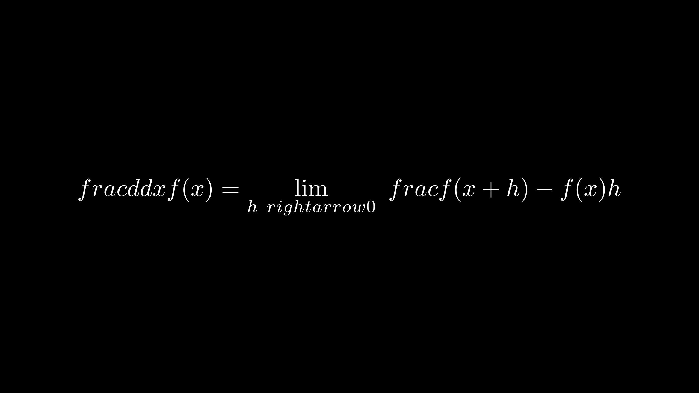

FontsFormulaColor字体公式色彩
==============================

manim会把LaTeX文字变成svg然后输出在屏幕上，所以就是一般的LaTeX笔记就行。

text数组,在 :ref:`animation显示操作 <DisplayOperation>`  中所有的显示方法几乎都可以对text数组成立。

TextMobject文本类:传入一个字符串，或者多个字符串的字符串数组，按照下表索引数组的值

LaTeX文本类TexMobject::显示为LaTeX格式(在想要LaTeX字符串按照数组显示时必须使用这个实现)

Notation符号:为了数学编辑方便复制粘贴，拉丁符号，包括常用的数学LaTeX公式等等。数学公式其实就是Latex公式，手册必备。Latex无所不能，还能用来写五线谱等等，只有想不到没有做不到的排版系统。

`视频教程 <https://www.bilibili.com/video/BV1W4411Z7Zt>`_  讲解到2_formula_format时有这两个例子说明
简单实用方法。

这是TexMobject中斜杠的使用对比：

.. code:: 

    class Formula(Scene): 
        def construct(self): 
            formula_tex_1=TexMobject(r"\ frac{d}{dx}f(x)=\lim_{h\ rightarrow 0}{\ frac{f(x+h)-f(x)}{h}}") 
            formula_tex_2=TexMobject("\\ frac{d}{dx}f(x)=\lim_{h\\ rightarrow 0}{\ frac{f(x+h)-f(x)}{h}}")
            self.add(formula_tex_2)

运行

.. code::

    python -m manim a.py Formula -ps .scale(2)#伸缩，2倍

    Formula

这是多行矩阵写法。

.. code:: 

    class DescompositionFormula(Scene): 
        def construct(self): 
            formula_tex=TexMobject(r"""
            \begin{bmatrix} a & a \\ a & a \\ a & a \end{bmatrix}
            """        )
            formula_tex.scale(3)
            self.add(formula_tex)

.. figure:: ../assets/image/DescompositionFormula.png
    :width: 100%
    :align: center

    DescompositionFormula

视频里面第一个在线编辑LaTeX的网站点不开，在线编辑LaTeX的链接：https://latexeditor.lagrida.com/ 

https://www.codecogs.com/latex/eqneditor.php?lang=zh-cn

.. toctree::
    :caption: Contents
    :maxdepth: 3

    TextMobject文本类
    LaTeX文本类TexMobject
    text数组
    text_like_arrays
    Chinese等
    Notation公式符号
    LaTeX特殊包
    