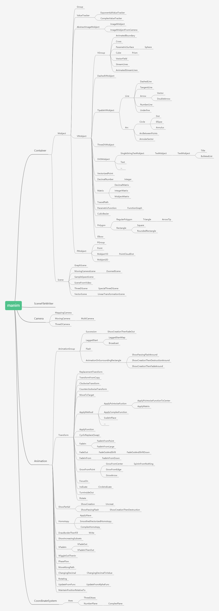

ManimLibrary库
====================

manimLibrary库,调包侠也有开发插件的梦想的，i have a dream：manim kindergarten 如果有一个在线插件仓库，manimlib只要复制进去一些工具类和模板，就能实现扩展定义的任务功能等等。

鹤翔万里在群里上传过几张的模块依赖图(详情可以看这里PyDoc生成的结果 :ref:`manim类属性方法 <manimlibClassesPropertiesMethods>`  ，继承关系等可以PyDoc链接不断查询)：

    Manim模块依赖图

.. figure:: ../assets/image/manim2Structure.png
    :width: 100%
    :align: center

    Manim结构

.. figure:: ../assets/image/manimRuntime.png
    :width: 100%
    :align: center

    Manim运行

