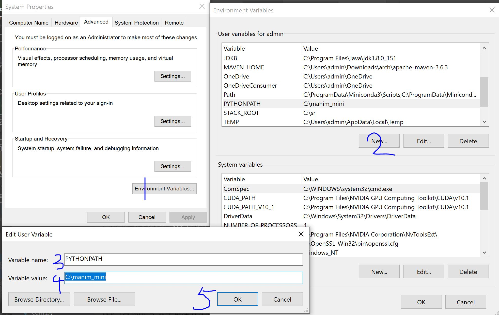

manim类属性方法
====================

.. _manimlibClassesPropertiesMethods:

Index of package manimlib

.. admonition:: 声明

  这页我用PyDoc生成的结果 ：manim类属性方法。用的是PyDoc，对应的是manimlib的类属性和方法。浏览器回退上一页快捷键是alt+左键，因为PyDoc需要开服务器，我设置点进去的页面链接取消使用，然后搜索功能能用。这也是我手撸的索引页面，排版丑陋，差不多这样吧。

| │
| │ `manimlib.constants.html <../_static/html/manimlib.constants.html>`__
| │ `manimlib.demo.html <../_static/html/manimlib.demo.html>`__ 
| │
  `manimlib.example_scenes.html <../_static/html/manimlib.example_scenes.html>`__
| │
  `manimlib.extract_scene.html <../_static/html/manimlib.extract_scene.html>`__
| │ `manimlib.imports.html <../_static/html/manimlib.imports.html>`__ 
| │
  `manimlib.stage_scenes.html <../_static/html/manimlib.stage_scenes.html>`__
| │ `manimlib.config.html <../_static/html/manimlib.config.html>`__ 
| │
| ├─animation
| │
  `animation_animation.html <../_static/html/animation_animation.html>`__
| │
  `animation_composition.html <../_static/html/animation_composition.html>`__
| │ `animation_creation.html <../_static/html/animation_creation.html>`__
| │ `animation_fading.html <../_static/html/animation_fading.html>`__ 
| │ `animation_growing.html <../_static/html/animation_growing.html>`__ 
| │
  `animation_indication.html <../_static/html/animation_indication.html>`__
| │ `animation_movement.html <../_static/html/animation_movement.html>`__
| │ `animation_numbers.html <../_static/html/animation_numbers.html>`__ 
| │ `animation_rotation.html <../_static/html/animation_rotation.html>`__
| │
  `animation_specialized.html <../_static/html/animation_specialized.html>`__
| │
  `animation_transform.html <../_static/html/animation_transform.html>`__
| │ `animation_update.html <../_static/html/animation_update.html>`__ 
| │
| ├─camera
| │ `camera_camera.html <../_static/html/camera_camera.html>`__ 
| │
  `camera\ mapping\ camera.html <../_static/html/camera_mapping_camera.html>`__
| │
  `camera\ moving\ camera.html <../_static/html/camera_moving_camera.html>`__
| │
  `camera\ multi\ camera.html <../_static/html/camera_multi_camera.html>`__
| │
  `camera\ three\ d_camera.html <../_static/html/camera_three_d_camera.html>`__
| │
| ├─container
| │ │
| │
  `container_container.html <../_static/html/container_container.html>`__
| │
| ├─mobject
| │ `mobject_changing.html <../_static/html/mobject_changing.html>`__ 
| │ `mobject_frame.html <../_static/html/mobject_frame.html>`__ 
| │ `mobject_functions.html <../_static/html/mobject_functions.html>`__ 
| │ `mobject_geometry.html <../_static/html/mobject_geometry.html>`__ 
| │ `mobject_matrix.html <../_static/html/mobject_matrix.html>`__ 
| │ `mobject_mobject.html <../_static/html/mobject_mobject.html>`__ 
| │
  `mobject\ mobject\ update_utils.html <../_static/html/mobject_mobject_update_utils.html>`__
| │ `mobject_numbers.html <../_static/html/mobject_numbers.html>`__ 
| │
  `mobject\ number\ line.html <../_static/html/mobject_number_line.html>`__
| │
  `mobject_probability.html <../_static/html/mobject_probability.html>`__
| │
  `mobject\ shape\ matchers.html <../_static/html/mobject_shape_matchers.html>`__
| │ `mobject\ svg\ brace.html <../_static/html/mobject_svg_brace.html>`__
| │
  `mobject\ svg\ drawings.html <../_static/html/mobject_svg_drawings.html>`__
| │
  `mobject\ svg\ text_mobject.html <../_static/html/mobject_svg_text_mobject.html>`__
| │
  `mobject\ svg\ tex_mobject.html <../_static/html/mobject_svg_tex_mobject.html>`__
| │
  `mobject\ three\ dimensions.html <../_static/html/mobject_three_dimensions.html>`__
| │
  `mobject\ three\ d\ shading\ utils.html <../_static/html/mobject_three_d_shading_utils.html>`__
| │
  `mobject\ three\ d_utils.html <../_static/html/mobject_three_d_utils.html>`__
| │
  `mobject\ types\ image_mobject.html <../_static/html/mobject_types_image_mobject.html>`__
| │
  `mobject\ types\ point\ cloud\ mobject.html <../_static/html/mobject_types_point_cloud_mobject.html>`__
| │
  `mobject\ types\ vectorized_mobject.html <../_static/html/mobject_types_vectorized_mobject.html>`__
| │
  `mobject\ value\ tracker.html <../_static/html/mobject_value_tracker.html>`__
| │
  `mobject\ vector\ field.html <../_static/html/mobject_vector_field.html>`__
| │
| ├─once\ *useful*\ constructs
| │
  `once\ useful\ constructs_arithmetic.html <../_static/html/once_useful_constructs_arithmetic.html>`__
| │
  `once\ useful\ constructs_combinatorics.html <../_static/html/once_useful_constructs_combinatorics.html>`__
| │
  `once\ useful\ constructs\ complex\ transformation_scene.html <../_static/html/once_useful_constructs_complex_transformation_scene.html>`__
| │
  `once\ useful\ constructs_counting.html <../_static/html/once_useful_constructs_counting.html>`__
| │
  `once\ useful\ constructs_fractals.html <../_static/html/once_useful_constructs_fractals.html>`__
| │
  `once\ useful\ constructs\ graph\ theory.html <../_static/html/once_useful_constructs_graph_theory.html>`__
| │
  `once\ useful\ constructs_light.html <../_static/html/once_useful_constructs_light.html>`__
| │
  `once\ useful\ constructs\ matrix\ multiplication.html <../_static/html/once_useful_constructs_matrix_multiplication.html>`__
| │
  `once\ useful\ constructs_region.html <../_static/html/once_useful_constructs_region.html>`__
| │
| ├─scene
| │ `scene\_
  scene\ from\ video.html <../_static/html/scene_ scene_from_video.html>`__
| │ `scene\ graph\ scene.html <../_static/html/scene_graph_scene.html>`__
| │
  `scene\ moving\ camera_scene.html <../_static/html/scene_moving_camera_scene.html>`__
| │
  `scene\ reconfigurable\ scene.html <../_static/html/scene_reconfigurable_scene.html>`__
| │
  `scene\ sample\ space_scene.html <../_static/html/scene_sample_space_scene.html>`__
| │ `scene_scene.html <../_static/html/scene_scene.html>`__ 
| │
  `scene\ scene\ file_writer.html <../_static/html/scene_scene_file_writer.html>`__
| │
  `scene\ three\ d_scene.html <../_static/html/scene_three_d_scene.html>`__
| │
  `scene\ vector\ space_scene.html <../_static/html/scene_vector_space_scene.html>`__
| │
  `scene\ zoomed\ scene.html <../_static/html/scene_zoomed_scene.html>`__
| │
| └─utils
| │ `utils_bezier.html <../_static/html/utils_bezier.html>`__ 
| │ `utils_color.html <../_static/html/utils_color.html>`__ 
| │ `utils\ config\ ops.html <../_static/html/utils_config_ops.html>`__ 
| │ `utils_debug.html <../_static/html/utils_debug.html>`__ 
| │ `utils\ file\ ops.html <../_static/html/utils_file_ops.html>`__ 
| │ `utils_images.html <../_static/html/utils_images.html>`__ 
| │ `utils_iterables.html <../_static/html/utils_iterables.html>`__ 
| │ `utils_paths.html <../_static/html/utils_paths.html>`__ 
| │
  `utils\ rate\ functions.html <../_static/html/utils_rate_functions.html>`__
| │
  `utils\ simple\ functions.html <../_static/html/utils_simple_functions.html>`__
| │ `utils_sounds.html <../_static/html/utils_sounds.html>`__ 
| │ `utils\ space\ ops.html <../_static/html/utils_space_ops.html>`__ 
| │ `utils_strings.html <../_static/html/utils_strings.html>`__ 
| └─\ `utils\ tex\ file_writing.html <../_static/html/utils_tex_file_writing.html>`__

授之以渔:

1. 首先，manim所在位置添加到PYTHONPATH,在打开PyDoc的时候被检测到。

    PYTHONPATH设置

2. 然后，打开命令行输入：   

  **python -m pydoc -p 8080**

给大家解释一下命令含义： 
python -m pydoc表示打开pydoc模块，这个模块就是用来查看python文档的工具

-p 1234表示在端口号8080上打开server，这个端口号可以自行设置

然后就可以在浏览器中打开链接“ http://localhost:8080/”看到如图所示的内容，还能动态查看依赖关系以及的用法等等，自己探索吧，这页面链接的manim类库应该是最新的。

然后如果添加manimlib//animation到PYTHONPATH，依旧报错不能读取manimlib(package)。我的解决办法是粘贴一个出来manim.py所在目录，然后点进去就可以看，属性方法继承关系等等。

其实是因为最开始我打算文档分类是打算根据manimlib的分类（animation、camera、container、mobject、scene、utils）进行的，但是索引查询+搜索查询才是好用的文档，manimlib也是类似地根据功能集群进行分类，所以为了方便查询，我最后根据图像、字体公式、坐标这些来分类记录。

既然已经有这页几乎囊括所有的类属性方法，PyDoc体验还很好，为什么后面几个章节elteoremadebeethoven起草的标题为“XXX类的属性和方法”我还是拿过来呢？

其实是因为elteoremadebeethoven选定了一些常用的类来讲解@manimlib的类库，然后后面马上给个py例子+mp4效果 ，我感觉这样的体验和后续的笔记保存都要好些。（-_-#

但是太多，似乎elteoremadebeethoven都感觉太无聊肝不下去导致TODO一年都没动静（不过基本每个人都有自己要忙的事情）。粘贴过来的目的是因为，我的想法是，万一以后闲着没事儿补点，万一我学习源码可以在这里直接做笔记Mark下来，或者有什么大神整下去呢？

