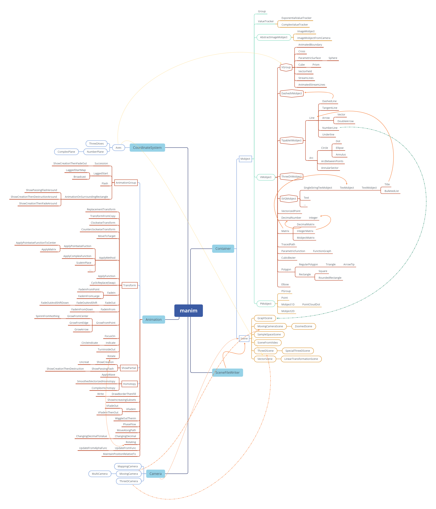
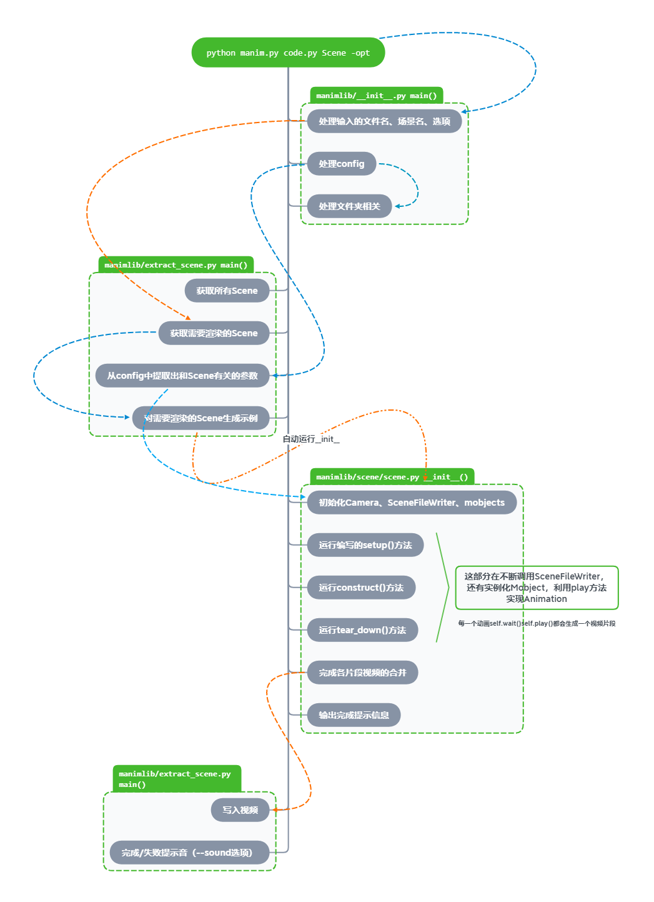

manim结构
=========

manim目录结构
-------------

| manim的目录看起来很复杂，文件很多，但是结构非常清晰
| 下面是manim的目录结构

.. code:: text

   ├── manim.py  # manim命令的入口
   ├── stage_scenes.py  # 整理运行过的视频文件(一般没有用)
   └── manimlib  # manim库
       ├── __init__.py       # 从这里运行
       ├── config.py         # 在这里处理命令传入的参数
       ├── extract_scene.py  # 提取、运行场景
       ├── imports.py        # 将manimlib中的所有需要的文件都import进来
       ├── constants.py      # 一些定义的常量
       ├── ctex_template.tex # 支持中文的tex模板(将使用xelatex编译)
       ├── tex_template.tex  # tex模板(将使用latex编译，一般不使用)
       ├── stream_starter.py # 流模式的开始
       ├── container # 容器
       │   └── container.py
       ├── scene # 场景
       │   ├── scene_file_writer.py     # 用于将scene写入视频文件
       │   ├── scene.py                 # 最普通的场景
       │   ├── three_d_scene.py         # 三维场景
       │   ├── graph_scene.py           # 图像场景(带坐标轴)
       │   ├── moving_camera_scene.py   # 移动相机的场景
       │   ├── reconfigurable_scene.py 
       │   ├── sample_space_scene.py    # 概率相关的样本空间场景
       │   ├── scene_from_video.py   
       │   ├── vector_space_scene.py    # 向量场场景
       │   └── zoomed_scene.py          # 放大场景
       ├── animation # 动画相关
       │   ├── animation.py     # 动画的父类
       │   ├── composition.py   # 动画组
       │   ├── creation.py      # 和Create有关的动画
       │   ├── fading.py        # 和Fade有关的动画
       │   ├── growing.py       # 和Grow有关的动画
       │   ├── indication.py    # 一些用于强调的动画
       │   ├── movement.py      # 和移动有关的动画
       │   ├── numbers.py       # 实现对DecimalNumber数字的变化
       │   ├── rotation.py      # 和旋转有关的动画
       │   ├── specialized.py   # 一些针对特殊项目的不常用动画
       │   ├── transform.py     # 一些Transform变换
       │   └── update.py        # 从函数实现update
       ├── camera # 相机
       │   ├── camera.py          # 普通的相机
       │   ├── mapping_camera.py  # 含有映射效果的相机
       │   ├── moving_camera.py   # 可以移动的相机
       │   ├── three_d_camera.py  # 三维相机
       │   └── multi_camera.py
       ├── files # 三个svg素材
       │   ├── Bubbles_speech.svg
       │   ├── Bubbles_thought.svg
       │   └── PiCreatures_plain.svg
       ├── for_3b1b_videos # 3b1b视频中用到的场景
       │   ├── common_scenes.py
       │   ├── pi_class.py
       │   ├── pi_creature_animations.py
       │   ├── pi_creature.py
       │   └── pi_creature_scene.py
       ├── mobject # (数学)物品
       │   ├── mobject.py   # 所有mobject的父类
       │   ├── types # 三种子类mobject
       │   │   ├── image_mobject.py        # 插入图片
       │   │   ├── point_cloud_mobject.py  # PMobject(点集构成的mobject)
       │   │   └── vectorized_mobject.py   # VMobject(向量化的mobject)
       │   ├── svg # 和svg有关的mobject
       │   │   ├── svg_mobject.py  # SVGMobject
       │   │   ├── brace.py        # 大括号
       │   │   ├── drawings.py     # svg图像的一些特殊mobject
       │   │   ├── tex_mobject.py  # 依赖LaTeX实现的文字
       │   │   └── text_mobject.py # 不依赖LaTeX实现的文字
       │   ├── coordinate_systems.py # 坐标系统
       │   ├── frame.py        # 和frame有关的mobject
       │   ├── functions.py    # 参数方程
       │   ├── geometry.py     # 几何图形的mobject
       │   ├── matrix.py       # 矩阵
       │   ├── number_line.py  # 数轴
       │   ├── numbers.py      # 可以变化的数字
       │   ├── probability.py  # 和概率有关的mobject
       │   ├── shape_matchers.py   # 适应其它物体大小的mobject
       │   ├── three_dimensions.py # 三维物体
       │   ├── three_d_shading_utils.py # 三维工具
       │   ├── three_d_utils.py # 三维工具
       │   ├── changing.py      # 动态变化的mobject
       │   ├── value_tracker.py # ValueTracker存储数的mobject
       │   └── vector_field.py  # 向量场 
       ├── once_useful_constructs # 3b1b为某些视频写的常用场景
       │   ├── arithmetic.py
       │   ├── combinatorics.py
       │   ├── complex_transformation_scene.py
       │   ├── counting.py
       │   ├── fractals.py
       │   ├── graph_theory.py
       │   ├── light.py
       │   ├── matrix_multiplication.py
       │   ├── NOTE.md
       │   └── region.py
       └── utils # 一些实用的工具函数
           ├── bezier.py      # 贝塞尔曲线
           ├── color.py       # 颜色
           ├── config_ops.py  # 处理CONFIG
           ├── file_ops.py    # 处理文件目录
           ├── images.py      # 读取图片
           ├── iterables.py   # 和列表字典处理有关的函数
           ├── paths.py       # 路径
           ├── rate_functions.py   # 一些定义的rate_function
           ├── simple_functions.py # 一些常用函数
           ├── sounds.py      # 处理声音
           ├── space_ops.py   # 空间坐标计算
           ├── strings.py     # 处理字符串
           └── tex_file_writing.py # 将字符串利用LaTeX写成svg

manim类的继承结构
-----------------

`这里 <https://github.com/manim-kindergarten/manim_sandbox/blob/master/documents/manim%E7%B1%BB%E7%BB%93%E6%9E%84.pdf>`_ 整理了一个manim类继承的pdf，
比较大，但是基本所有的类都有包含

manim运行顺序
-------------

manim运行的主要顺序如上图所示

