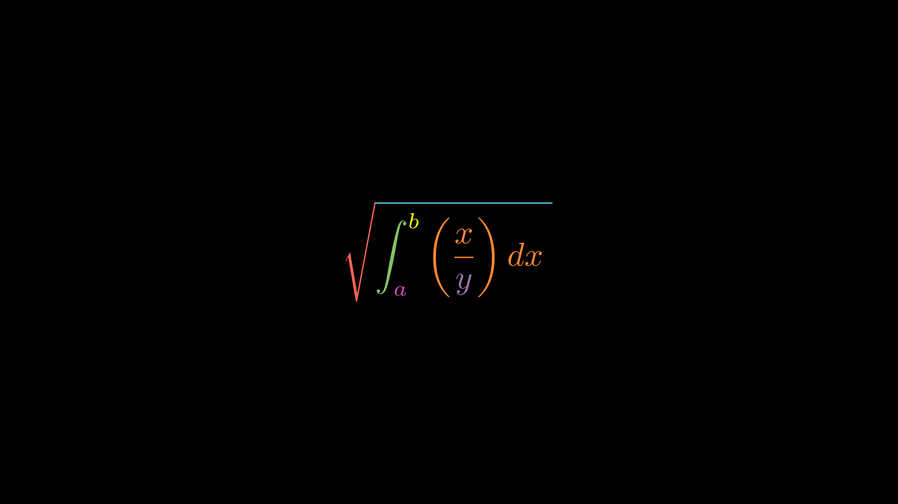

CheckFormulaByTXT工具类
=========================

.. admonition:: 前置知识

   前置知识，CONFIG配置变量参数属性和自定义工具类， 这部分主要是学习的这个比较好的 `视频教程 <https://www.bilibili.com/video/BV1W4411Z7Zt>`_  ，因为真的很细，但是不想每次要用一个个视频去翻，我决定mark下来一些有用的方便平时使用。

这里讲工具类安装使用，这里用视频中的例子来举例，CheckFormulaByTXT工具类，还是无敌的elteoremadebeethoven写的，仓库链接前面提过很多次了。

.. code:: 

    '''
    
    #CheckFormulaByTXT工具类
    class CheckFormulaByTXT(Scene):
        CONFIG={
        "camera_config":{"background_color": BLACK},
        "svg_type":"text",
        "text": TexMobject(""),
        "file":"",
        "svg_scale":0.9,
        "angle":0,
        "flip_svg":False,
        "fill_opacity": 1,
        "remove": [],
        "stroke_color": WHITE,
        "fill_color": WHITE,
        "stroke_width": 3,
        "numbers_scale":0.5,
        "show_numbers": True,
        "animation": False,
        "direction_numbers": UP,
        "color_numbers": RED,
        "space_between_numbers":0,
        "show_elements":[],
        "color_element":BLUE,
        "set_size":"width",
        "remove_stroke":[],
        "show_stroke":[],
        "warning_color":RED,
        "stroke_":1
        }
        def construct(self):
            self.imagen=self.text
            self.imagen.set_width(FRAME_WIDTH)
            if self.imagen.get_height()>FRAME_HEIGHT:
                self.imagen.set_height(FRAME_HEIGHT)
            self.imagen.scale(self.svg_scale)
            if self.flip_svg==True:
                self.imagen.flip()
            if self.show_numbers==True:
                self.print_formula(self.imagen.copy(),
                    self.numbers_scale,
                    self.direction_numbers,
                    self.remove,
                    self.space_between_numbers,
                    self.color_numbers)
    
            self.return_elements(self.imagen.copy(),self.show_elements)
            for st in self.remove_stroke:
                self.imagen[st].set_stroke(None,0)
            for st in self.show_stroke:
                self.imagen[st].set_stroke(None,self.stroke_)
            if self.animation==True:
                self.play(DrawBorderThenFill(self.imagen))
            else:
                c=0
                for j in range(len(self.imagen)):
                    permission_print=True
                    for w in self.remove:
                        if j==w:
                            permission_print=False
                    if permission_print:
                        self.add(self.imagen[j])
                c = c + 1
            self.personalize_image()
            self.wait()
    
        def personalize_image(self):
            pass
    
        def print_formula(self,text,inverse_scale,direction,exception,buff,color):
            text.set_color(self.warning_color)
            self.add(text)
            c = 0
            for j in range(len(text)):
                permission_print=True
                for w in exception:
                    if j==w:
                        permission_print=False
                if permission_print:
                    self.add(text[j].set_color(self.stroke_color))
            c = c + 1
    
            c=0
            for j in range(len(text)):
                permission_print=True
                element = TexMobject("%d" %c,color=color)
                element.scale(inverse_scale)
                element.next_to(text[j],direction,buff=buff)
                for w in exception:
                    if j==w:
                        permission_print=False
                if permission_print:
                    self.add_foreground_mobjects(element)
                c = c + 1 
    
        def return_elements(self,formula,adds):
            for i in adds:
                self.add_foreground_mobjects(formula[i].set_color(self.color_element),
                    TexMobject("%d"%i,color=self.color_element,background_stroke_width=0).scale(self.numbers_scale).next_to(formula[i],self.direction_numbers,buff=self.space_between_numbers))
    '''

manimlib/extensions/extensions_imports.py文件中写入

.. code::

	from manimlib.extensions.check_formula_by_txt.check_formula_by_txt import *

然后把CheckFormulaByTXT工具类的py文件+gif文件资料+markdown说明书一起放在manimlib/extensions/x文件夹，这样就能统一管理插件工具类，要什么加什么，如果不常用的工具类，可以在py文件中手动import，那就不需要写入manimlib/extensions/manimlib/extensions_imports.py。

为什么我想放在一个插件文件夹里面呢？其实是因为随便约定一个统一的管理模式，方便管理的一种建议而已。

不喜欢的完全可以手动复制喜欢的地方自己手动import,但是如果约定下来文件夹，就可以用我前面 About关于 说的，插件安装.bat 来实现统一管理和自动安装功能省心一点。

做完这个就能注释掉上述工具类（写代码的时候完全不粘贴进去部分），下面继承自CheckFormulaByTXT的CheckFormula1也能正常用。

视频中还提到放大看出来图片大括号中间有间隔缝隙，可以改进，方法是：

在manim\\manimlib\\mobject\\svg\\tex_mobject.py中class SingleStringTexMobject(SVGMobject):配置的 "background_stroke_width": 1,

this parameter is used to add shadow to objects，改成0即可。

使用工具类的代码如下：

.. code:: 

    class CheckFormula1(CheckFormulaByTXT): 
        CONFIG={
        "text": TexMobject(
                "\\sqrt{", #0,1双斜杠占用两个，分别可以赋值不同颜色
                "\\int_{",   #2
                "a}^",  #3
                "{b}",   #4
                "\\left(", #5
                "\\frac{x}{y}",  #6
                "\\right)",  #7
                "dx\\tiny .}"  #8
                ),
        "show_elements":[1,2,3]#详细参数属性设置可以看定义文件。
        }

.. figure:: ../assets/image/CheckFormula1.png
    :width: 100%
    :align: center

    CheckFormula1

这里是在写公式数组，笔记来源是 `这一节视频 <https://www.bilibili.com/video/BV1W4411Z7Zt?p=10>`_  。
 
.. code:: 

    class FormulaColor3(Scene): 
        def construct(self):
            text = TexMobject(
                "\\sqrt{", #0,1双斜杠占用两个，分别可以赋值不同颜色
                "\\int_{",   #2
                "a}^",  #3
                "{b}",   #4
                "\\left(", #5
                "\\frac{x}{y}",  #6
                "\\right)",  #7
                "dx\\tiny .}"  #8#写"dx}"只会显示而不是dx，#"\\tiny .}"                  
                )
            text[0].set_color(RED)
            text[1].set_color(BLUE)
            text[2].set_color(GREEN)
            text[3].set_color(YELLOW)
            text[4].set_color(PINK)
            text[5].set_color(ORANGE)
            text[6].set_color(PURPLE)
            text[7].set_color(MAROON)
            #text.set_color_by_tex("y",ORANGE)#建议仅仅在texts中用好了，formula中可能会报错。
            self.play(Write(text))
            self.wait(2)
    '''   
    python -m manim a.py FormulaColor3 -ps #我把上述两个代码块写在同一个文件中，我试了试，也会执行CheckFormula1，写两次文字text的svg文件到磁盘中，如果CONFIG中定义的不一样，用的是第二次定义的文本结果。其实我想知道为什么。
    https://docs.python.org/3/tutorial/                            
    https://www.digitalocean.com/community/tutorials/how-to-use-args-and-kwargs-in-python-3
    
    '''     

    FormulaColor3

