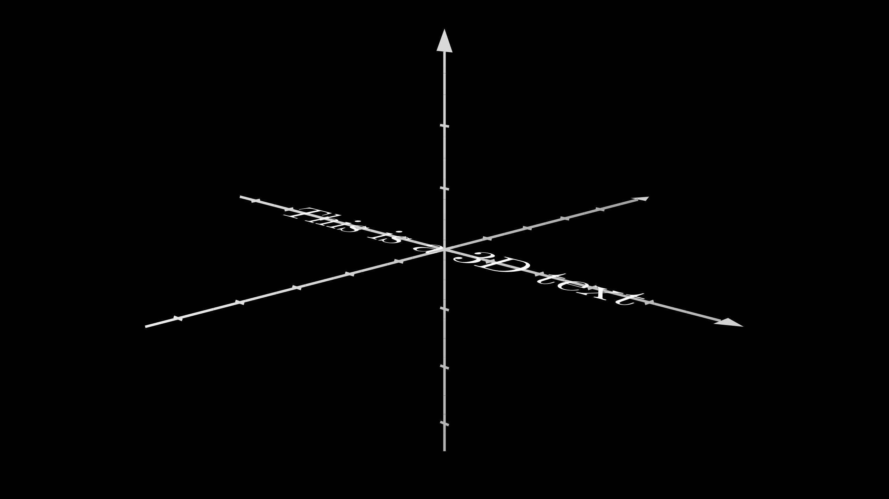
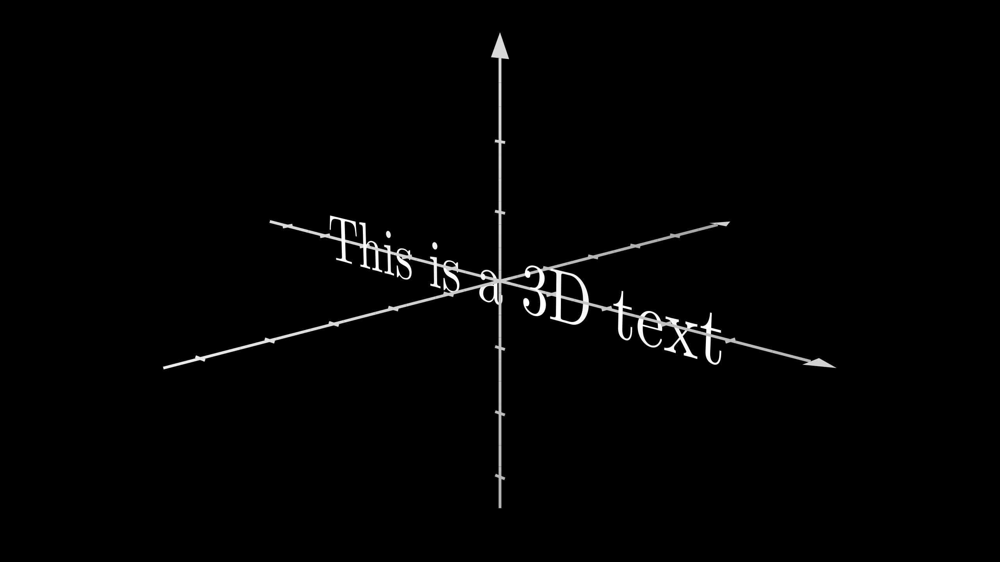

plot_3D
~~~~~~~~~~~~~~~~~~~~~~~~~~~~~~~
Elteoremadebeethoven's code:

.. code:: 

    from manimlib.imports import *

.. code:: 

    #There seems to be no change between Scene and ThreeDScene
    class CameraPosition1(ThreeDScene):
        def construct(self):
            circulo=Circle()
            self.play(ShowCreation(circulo))
            self.wait()

    '''
    We have to add this line:
    
        def get_axis(self, min_val, max_val, axis_config):
            new_config = merge_config([
                axis_config,
                {"x_min": min_val, "x_max": max_val},
                self.number_line_config,
            ])
            return NumberLine(**new_config)
    
    in manimlib/mobject/coordinate_systems.py
    
    Use: 
    self.set_camera_orientation(phi,theta,distance,gamma) 
    to change the camera position
    You can change the domain with:
    ThreeDAxes(
        x_min.
        x_max,
        y_min,
        y_max,
        z_min,
        z_max
    )
    '''

.. raw:: html

    <video width="560" height="315" controls>
        <source src="../_static/plots_3D/CameraPosition1.mp4" type="video/mp4">
    </video>

.. code:: 

    class CameraPosition2(ThreeDScene):
        def construct(self):
            axes = ThreeDAxes()
            circle=Circle()
            self.set_camera_orientation(phi=0 * DEGREES)
            self.play(ShowCreation(circle),ShowCreation(axes))
            self.wait()

.. raw:: html

    <video width="560" height="315" controls>
        <source src="../_static/plots_3D/CameraPosition2.mp4" type="video/mp4">
    </video>

.. code:: 

    class CameraPosition3(ThreeDScene):
        def construct(self):
            axes = ThreeDAxes()
            circle=Circle()
            self.set_camera_orientation(phi=80 * DEGREES,theta=45*DEGREES)
            self.play(ShowCreation(circle),ShowCreation(axes))
            self.wait()

.. raw:: html

    <video width="560" height="315" controls>
        <source src="../_static/plots_3D/CameraPosition3.mp4" type="video/mp4">
    </video>

    
.. code:: 

    class CameraPosition4(ThreeDScene):
        def construct(self):
            axes = ThreeDAxes()
            circle=Circle()
            self.set_camera_orientation(phi=80 * DEGREES,theta=45*DEGREES,distance=6)
            self.play(ShowCreation(circle),ShowCreation(axes))
            self.wait()

.. raw:: html

    <video width="560" height="315" controls>
        <source src="../_static/plots_3D/CameraPosition4.mp4" type="video/mp4">
    </video>

.. code:: 

    class CameraPosition5(ThreeDScene):
        def construct(self):
            axes = ThreeDAxes()
            circle=Circle()
            self.set_camera_orientation(phi=80 * DEGREES,theta=45*DEGREES,distance=6,gamma=30*DEGREES)
            self.play(ShowCreation(circle),ShowCreation(axes))
            self.wait()

.. raw:: html

    <video width="560" height="315" controls>
        <source src="../_static/plots_3D/CameraPosition5.mp4" type="video/mp4">
    </video>

?? Move camera

.. code:: 

    class MoveCamera1(ThreeDScene):
        def construct(self):
            axes = ThreeDAxes()
            circle=Circle()
            self.play(ShowCreation(circle),ShowCreation(axes))
            self.move_camera(phi=30*DEGREES,theta=-45*DEGREES,run_time=3)
            self.wait()

.. raw:: html

    <video width="560" height="315" controls>
        <source src="../_static/plots_3D/MoveCamera1.mp4" type="video/mp4">
    </video>

.. code:: 

    class MoveCamera2(ThreeDScene):
        def construct(self):
            axes = ThreeDAxes()
            circle=Circle()
            self.set_camera_orientation(phi=80 * DEGREES)           
            self.play(ShowCreation(circle),ShowCreation(axes))
            self.begin_ambient_camera_rotation(rate=0.1)            #Start move camera
            self.wait(5)
            self.stop_ambient_camera_rotation()                     #Stop move camera
            self.move_camera(phi=80*DEGREES,theta=-PI/2)            #Return the position of the camera
            self.wait()

.. raw:: html

    <video width="560" height="315" controls>
        <source src="../_static/plots_3D/MoveCamera2.mp4" type="video/mp4">
    </video>

Funciones parametricas

.. code:: 

    class ParametricCurve1(ThreeDScene):
        def construct(self):
            curve1=ParametricFunction(
                    lambda u : np.array([
                    1.2*np.cos(u),
                    1.2*np.sin(u),
                    u/2
                ]),color=RED,t_min=-TAU,t_max=TAU,
                )
            curve2=ParametricFunction(
                    lambda u : np.array([
                    1.2*np.cos(u),
                    1.2*np.sin(u),
                    u
                ]),color=RED,t_min=-TAU,t_max=TAU,
                )
            axes = ThreeDAxes()
    
            self.add(axes)
    
            self.set_camera_orientation(phi=80 * DEGREES,theta=-60*DEGREES)
            self.begin_ambient_camera_rotation(rate=0.1) 
            self.play(ShowCreation(curve1))
            self.wait()
            self.play(Transform(curve1,curve2),rate_func=there_and_back,run_time=3)
            self.wait()

.. raw:: html

    <video width="560" height="315" controls>
        <source src="../_static/plots_3D/ParametricCurve1.mp4" type="video/mp4">
    </video>

Add this in the object: .set_shade_in_3d(True)

.. code:: 

    class ParametricCurve2(ThreeDScene):
        def construct(self):
            curve1=ParametricFunction(
                    lambda u : np.array([
                    1.2*np.cos(u),
                    1.2*np.sin(u),
                    u/2
                ]),color=RED,t_min=-TAU,t_max=TAU,
                )
            curve2=ParametricFunction(
                    lambda u : np.array([
                    1.2*np.cos(u),
                    1.2*np.sin(u),
                    u
                ]),color=RED,t_min=-TAU,t_max=TAU,
                )
    
            curve1.set_shade_in_3d(True)
            curve2.set_shade_in_3d(True)
    
            axes = ThreeDAxes()
    
            self.add(axes)
    
            self.set_camera_orientation(phi=80 * DEGREES,theta=-60*DEGREES)
            self.begin_ambient_camera_rotation(rate=0.1) 
            self.play(ShowCreation(curve1))
            self.wait()
            self.play(Transform(curve1,curve2),rate_func=there_and_back,run_time=3)
            self.wait()

.. raw:: html

    <video width="560" height="315" controls>
        <source src="../_static/plots_3D/ParametricCurve2.mp4" type="video/mp4">
    </video>

.. code:: 

    #----- Surfaces
    class SurfacesAnimation(ThreeDScene):
        def construct(self):
            axes = ThreeDAxes()
            cylinder = ParametricSurface(
                lambda u, v: np.array([
                    np.cos(TAU * v),
                    np.sin(TAU * v),
                    2 * (1 - u)
                ]),
                resolution=(6, 32)).fade(0.5) #Resolution of the surfaces
    
            paraboloid = ParametricSurface(
                lambda u, v: np.array([
                    np.cos(v)*u,
                    np.sin(v)*u,
                    u**2
                ]),v_max=TAU,
                checkerboard_colors=[PURPLE_D, PURPLE_E],
                resolution=(10, 32)).scale(2)
    
            para_hyp = ParametricSurface(
                lambda u, v: np.array([
                    u,
                    v,
                    u**2-v**2
                ]),v_min=-2,v_max=2,u_min=-2,u_max=2,checkerboard_colors=[BLUE_D, BLUE_E],
                resolution=(15, 32)).scale(1)
    
            cone = ParametricSurface(
                lambda u, v: np.array([
                    u*np.cos(v),
                    u*np.sin(v),
                    u
                ]),v_min=0,v_max=TAU,u_min=-2,u_max=2,checkerboard_colors=[GREEN_D, GREEN_E],
                resolution=(15, 32)).scale(1)
    
            hip_one_side = ParametricSurface(
                lambda u, v: np.array([
                    np.cosh(u)*np.cos(v),
                    np.cosh(u)*np.sin(v),
                    np.sinh(u)
                ]),v_min=0,v_max=TAU,u_min=-2,u_max=2,checkerboard_colors=[YELLOW_D, YELLOW_E],
                resolution=(15, 32))
    
            ellipsoid=ParametricSurface(
                lambda u, v: np.array([
                    1*np.cos(u)*np.cos(v),
                    2*np.cos(u)*np.sin(v),
                    0.5*np.sin(u)
                ]),v_min=0,v_max=TAU,u_min=-PI/2,u_max=PI/2,checkerboard_colors=[TEAL_D, TEAL_E],
                resolution=(15, 32)).scale(2)
    
            sphere = ParametricSurface(
                lambda u, v: np.array([
                    1.5*np.cos(u)*np.cos(v),
                    1.5*np.cos(u)*np.sin(v),
                    1.5*np.sin(u)
                ]),v_min=0,v_max=TAU,u_min=-PI/2,u_max=PI/2,checkerboard_colors=[RED_D, RED_E],
                resolution=(15, 32)).scale(2)
    
    
            self.set_camera_orientation(phi=75 * DEGREES)
            self.begin_ambient_camera_rotation(rate=0.2)
    
    
            self.add(axes)
            self.play(Write(sphere))
            self.wait()
            self.play(ReplacementTransform(sphere,ellipsoid))
            self.wait()
            self.play(ReplacementTransform(ellipsoid,cone))
            self.wait()
            self.play(ReplacementTransform(cone,hip_one_side))
            self.wait()
            self.play(ReplacementTransform(hip_one_side,para_hyp))
            self.wait()
            self.play(ReplacementTransform(para_hyp,paraboloid))
            self.wait()
            self.play(ReplacementTransform(paraboloid,cylinder))
            self.wait()
            self.play(FadeOut(cylinder))

.. raw:: html

    <video width="560" height="315" controls>
        <source src="../_static/plots_3D/SurfacesAnimation.mp4" type="video/mp4">
    </video>

We have to add this method源码 `` manimlib/mobject/coordinate_systems.py  `` Axes 类中添加方法:

.. code:: python3

       def get_axis(self, min_val, max_val, axis_config):

           new_config = merge_config([

               axis_config,

               {"x_min": min_val, "x_max": max_val},

               self.number_line_config,

           ])

           return NumberLine(**new_config)

in Axes class: manimlib/mobject/coordinate_systems.py

| Use: 
| ``self.set_camera_orientation(phi,theta,distance,gamma)``
| to change the camera position
| You can change the domain with:

.. code::

    ThreeDAxes(
        x_min.
        x_max,
        y_min,
        y_max,
        z_min,
        z_max
        )

Programs程序

.. code:: 

    #---- Text on 3D
    class Text3D1(ThreeDScene):
        def construct(self):
            axes = ThreeDAxes()
            self.set_camera_orientation(phi=75 * DEGREES,theta=-45*DEGREES)
            text3d=TextMobject("This is a 3D text").scale(2)
            self.add(axes,text3d)

This text appears in XY plane, to rotate:

上面代码只用了self.add，输出图片

.. code::

    python -m manim  6b_plots_3D.py Text3D1 -ps 

    Text3D1

.. code:: 

    class Text3D2(ThreeDScene):
        def construct(self):
            axes = ThreeDAxes()
            self.set_camera_orientation(phi=75 * DEGREES,theta=-45*DEGREES)
            text3d=TextMobject("This is a 3D text").scale(2).set_shade_in_3d(True) 
            text3d.rotate(PI/2,axis=RIGHT)
            self.add(axes,text3d)

.. code::

    python -m manim  6b_plots_3D.py Text3D2 -ps 

    Text3D2

.. code:: 

    # To see the text in the traditional form:
    class Text3D3(ThreeDScene):
        def construct(self):
            axes = ThreeDAxes()
            self.set_camera_orientation(phi=75 * DEGREES,theta=-45*DEGREES)
            text3d=TextMobject("This is a 3D text")
    
            self.add_fixed_in_frame_mobjects(text3d) #<----- Add this
            text3d.to_corner(UL)
    
            self.add(axes)
            self.begin_ambient_camera_rotation()
            self.play(Write(text3d))
    
            sphere = ParametricSurface(
                lambda u, v: np.array([
                    1.5*np.cos(u)*np.cos(v),
                    1.5*np.cos(u)*np.sin(v),
                    1.5*np.sin(u)
                ]),v_min=0,v_max=TAU,u_min=-PI/2,u_max=PI/2,checkerboard_colors=[RED_D, RED_E],
                resolution=(15, 32)).scale(2)
    
            self.play(LaggedStart(ShowCreation,sphere))
            self.wait(2)

.. code::

    python -m manim  6b_plots_3D.py Text3D3 -pl

报错，

.. code::

    Traceback (most recent call last):
    File "C:\manimlib\extract_scene.py", line 155, in main
        scene = SceneClass(**scene_kwargs)
    File "C:\manimlib\scene\scene.py", line 53, in __init__
        self.construct()
    File "6b_plots_3D.py", line 309, in construct
        self.play(LaggedStart(ShowCreation,sphere))
    File "C:\manimlib\animation\composition.py", line 34, in __init__
        [anim.mobject for anim in animations]
    File "C:\manimlib\animation\composition.py", line 34, in <listcomp>
        [anim.mobject for anim in animations]
    AttributeError: type object 'ShowCreation' has no attribute 'mobject'

于是要解决问题，

.. code::

    # To see the text in the traditional form:
    class Text3D3(ThreeDScene):
        def construct(self):
            axes = ThreeDAxes()
            self.set_camera_orientation(phi=75 * DEGREES,theta=-45*DEGREES)
            text3d=TextMobject("This is a 3D text")

            self.add_fixed_in_frame_mobjects(text3d) #<----- Add this
            text3d.to_corner(UL)

            self.add(axes)
            self.begin_ambient_camera_rotation()
            self.play(Write(text3d))

            sphere = ParametricSurface(
                lambda u, v: np.array([
                    1.5*np.cos(u)*np.cos(v),
                    1.5*np.cos(u)*np.sin(v),
                    1.5*np.sin(u)
                ]),v_min=0,v_max=TAU,u_min=-PI/2,u_max=PI/2,checkerboard_colors=[RED_D, RED_E],
                resolution=(15, 32)).scale(2)
            #self.play(LaggedStart(ShowCreation,sphere))#鹏翔万里说新版本已经改动了，群友引力子说：lagged start应该是让动画依次显示，而不是同时播放
            self.play(ShowCreation(sphere, lag_ratio=0.5))#群友鹤翔万里说：现在的LaggedStart是AnimationGroup的子类，传入的是一系列动画实例。LaggedStart换成新的了，以前的LaggedStart改成了LaggedStartMap
            #那要怎么知道ShowCreation的用法呢？
            #使用官网仓库的github搜索，比如搜索ShowCreation，能看到例子ShowCreation(arrows, lag_ratio = 0.5)，看例子就是最好的教程，ShowCreation(dot, run_time = 1.0)，，https://github.com/3b1b/manim/search?q=ShowCreation&unscoped_q=ShowCreation
            # 在ctrl点击找到的manimlib/animation/creation.py中ShowCreation定义代码CONFIG没有看到runtime属性，是因为它的父类的父类设置这runtime的值。
            # self.play(Write(sphere))#这样写也可以,但动画不一样了。
            # 鹏翔万里告诉我告诉我一个查看旧的laggedstart的定义方式的好办法，那就是github仓库搜索LaggedStart之后选commit查看旧的未改动的LaggedStart长什么样子就知道了。
            self.wait(2)

于是改好之后，效果是这样的：

.. raw:: html

    <video width="560" height="315" controls>
        <source src="../_static/plots_3D/Text3D3.mp4" type="video/mp4">
    </video>

